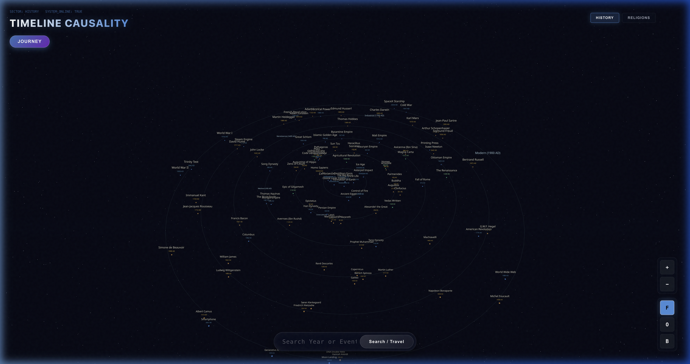
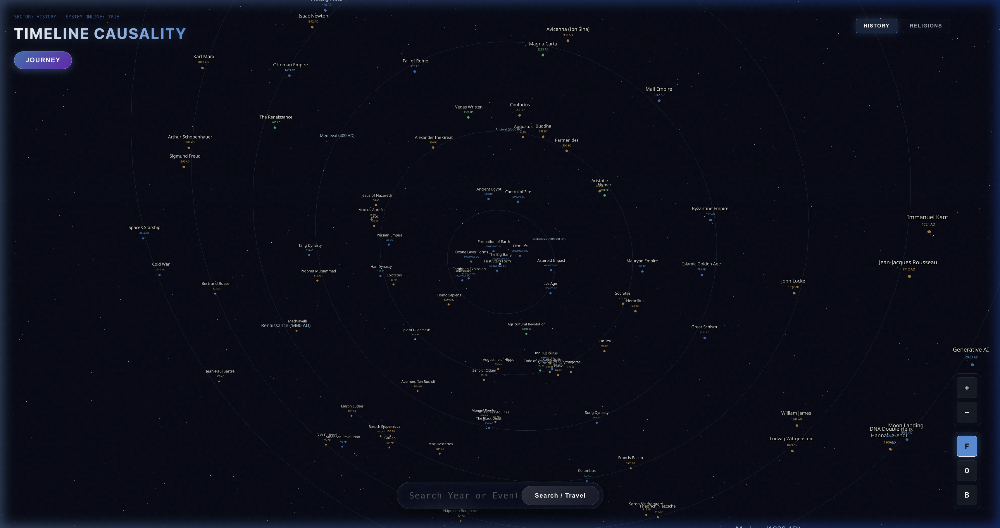

# Thought — 3D Timeline Causality Map

An interactive 3D visualization of history's major turning points, rendered as a rotating solar system. Explore philosophical lineages, scientific breakthroughs, and civilizational shifts from the Big Bang to the modern day — all connected by glowing causality chains.

## Visual Overview (Real Project Captures)

### Global Cosmic Chronology


### High-Fidelity Detail


---

## Features

- 🌌 **Solar System orbit layout** — each era occupies a concentric orbital ring
- 🔗 **Causality chain tracing** — click any node to reveal its root causes and downstream consequences
- 🔭 **Dynamic label scaling** — labels grow as you zoom out to stay legible
- 🕹️ **Journey Mode** — step sequentially through history from the Big Bang onward
- 🔍 **Text & year search** — fly the camera directly to any event or philosopher by name or date
- 💬 **Frosted-glass sidebar** — detailed context panel with interactive navigation buttons

---

## Setup

### Prerequisites

- [Node.js](https://nodejs.org/) **v18 or later**
- [npm](https://www.npmjs.com/) (comes bundled with Node.js)
- [Git](https://git-scm.com/)

### 1. Clone the repository

```bash
git clone https://github.com/Arjitc12/Thought.git
cd Thought
```

### 2. Install dependencies

```bash
npm install
```

This installs all required packages including React, Three.js, `@react-three/fiber`, `@react-three/drei`, and Framer Motion.

### 3. Start the development server

```bash
npm run dev
```

Open your browser and navigate to **http://localhost:5173** (or whichever port Vite prints in the terminal).

### 4. Build for production (optional)

```bash
npm run build
```

The production-ready output will be placed in the `dist/` folder.

---

## Tech Stack

| Layer | Technology |
|---|---|
| Framework | React 18 + Vite |
| 3D Engine | Three.js via `@react-three/fiber` |
| 3D Helpers | `@react-three/drei` |
| Animations | Framer Motion |
| Styling | Vanilla CSS |

---

## Project Structure

```
Thought/
├── public/             # Static assets (screenshot etc.)
├── src/
│   ├── components/
│   │   ├── 3d/         # Scene, Node, Edge — core 3D rendering
│   │   └── ui/         # Overlay, DateSearch, NewsOverlay, MiniMap
│   ├── data/
│   │   └── dataset.js  # Hardcoded historical event dataset
│   └── main.jsx        # App entry point
├── package.json
└── vite.config.js
```
